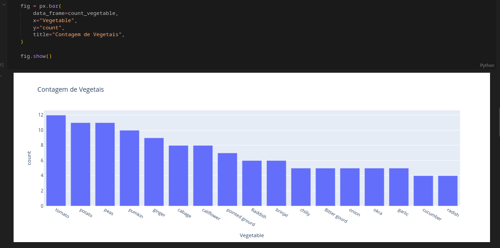

# Aprenda Machine Learning

## Sumário
- [Aprenda Machine Learning](#aprenda-machine-learning)
    - [Sumário](#sumário)
    - [Introducao](#introducão)
    - [Análise de Dados](#análise-de-dados)
        - [Visualizacão](#visualizacão)
            - [Informacões gerais](#informacões-gerais)
            - [Gráfico em Barra](#gráfico-em-barra)
    - [Usabilidade](#usabilidade)
        - [Clone o Repositório](#clone-esse-repositório)
        - [Instale as Dependências](#instale-as-dependências)
    - [Contatos](#contatos)


## Introducão

Esse é um repositório introdutório ao conceito de Machine Learning e alguns algoritmos usados nessa área. Partindo do zero até o entendimento da análise e aplicacão dos modelos.

Aqui será tratado tópicos relacionados a visualizacão dos dados, tipos de dados, pré-processamento funcionamento da aprendizagem e etc. Trazendo de maneira teórica e prática cada tópico.

Os códigos devem ser feitos -em sua maioria- utilizando arquivos ```.ipynb```, usando o [Jupyter Notebook](https://jupyter.org/) ou o [Google Colab](https://colab.research.google.com/)

## Análise de Dados

A etapa inicial do processo de Machine Learning (ML) vem da análise de dados, nesse processo toda a base será avaliada para saber se as informacões contidas em si podem ser utilizadas nos modelos. Caso haja irregularidades, será nesse processo em que elas serão corrigidas.

### Visualizacão

Antes de tudo, precisamos ver quais são os dados que possuimos, para isso será utilizada a biblioteca [Pandas](https://pandas.pydata.org/) e também a ferramenta de geracão de gráficos [Plotly](https://plotly.com/python/), em especial o seu pacote `express`.

#### Informacões gerais

No pandas, podemos ler arquivos que contenham tabelas como `.csv`, `.parquet`, ``.db`` e etc. Com o seguinte comando usando o exemplo de um arquivo csv:

```python
import pandas as pd

data = pd.read_csv("caminho_do_arquivo")
```

Assim, o arquivo será guardado em uma variável do python. Essa tabela pode ser vista digitando novamente a variável.

[](/src/pre_processing/data_visualization.ipynb)

Ainda com o pandas, podemos ver algumas informacões gerais sobre a tabela usando a funcão `.info()` e `.describe()`

[](/src/pre_processing/data_visualization.ipynb)

#### Gráfico em Barra

Para a producão do gráfico em barra, a funcão utilizada será a `bar()`. Com o seguitne escopo:

```python
import plotly.express as px

fig = px.bar(
    data_frame=tabela,
    x=coluna_da_tabela,
    y=outra_coluna,
    title=titulo_do_gráfico
)

fig.show()
```

No nosso caso temos esse exemplo:

[](/src/pre_processing/data_visualization.ipynb)
## Usabilidade

Para ter esse repositóprio e manipular os arquivos localmentem, basta copiar e colar os seguintes comandos no terminal:

### Clone o repositório

```bash
git clone https://github.com/Rafaelszc/Aprenda-Machine-Learning.git
```

### Instale as Dependências

```bash
cd Aprenda-Machine-Learning/

pip install -r requirements.txt
```

## Contatos
<div class="contact-images" align=center>
    <a href="https://github.com/Rafaelszc"></a>
    <a href="mailto:rafaelbjj84@gmail.com"></a>
    <a href="https://www.linkedin.com/in/rafael-souza-5461762b8"></a>
</div>