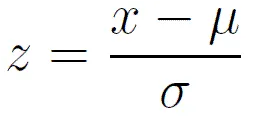

# Aprenda Machine Learning

## Sumário
- [Aprenda Machine Learning](#aprenda-machine-learning)
  - [Sumário](#sumário)
  - [Introducão](#introducão)
  - [Análise de Dados](#análise-de-dados)
    - [Visualizacão](#visualizacão)
      - [Informacões gerais](#informacões-gerais)
      - [Gráfico em Barra](#gráfico-em-barra)
  - [Tratamento dos Dados](#tratamento-dos-dados)
    - [Tipos de Dados](#tipos-de-dados)
      - [Numéricos e Categóricos](#numéricos-e-categóricos)
      - [X e Y](#x-e-y)
    - [Codificacão](#codificacão)
    - [Padronização](#padronização)
    - [Normalização](#normalização)
  - [Salvamento de variáveis](#salvamento-de-variáveis)
  - [Modelos de Classificacão](#modelos-de-classificacão)
    - [Navie Bayes](#navie-bayes)
    - [Random Forest Classifier](#random-forest-classifier)
    - [K-Nearest Neighborn Classifier (KNN)](#k-nearest-neighborn-classifier-knn)
  - [Modelos de Regressão](#modelos-de-regressão)
    - [K-Nearest Neighborn Regressor (KNN Regressor)](#k-nearest-neighborn-regressor-knn-regressor)
    - [SGD Regressor](#sgd-regressor)
  - [Ensambles](#ensambles)
    - [AutoGluon](#autogluon)
  - [Usabilidade](#usabilidade)
    - [Clone o repositório](#clone-o-repositório)
    - [Instale as Dependências](#instale-as-dependências)
      - [Usando o Pip](#usando-o-pip)
      - [Usando o Anaconda](#usando-o-anaconda)
  - [Contatos](#contatos)
  - [Referências](#referências)


## Introducão

Esse é um repositório introdutório ao conceito de Machine Learning e alguns algoritmos usados nessa área. Partindo do zero até o entendimento da análise e aplicacão dos modelos.

Aqui será tratado tópicos relacionados a visualizacão dos dados, tipos de dados, pré-processamento funcionamento da aprendizagem e etc. Trazendo de maneira teórica e prática cada tópico.

Os códigos devem ser feitos -em sua maioria- utilizando arquivos ```.ipynb```, usando o [Jupyter Notebook](https://jupyter.org/) ou o [Google Colab](https://colab.research.google.com/)

## Análise de Dados

A etapa inicial do processo de Machine Learning (ML) vem da análise de dados, nesse processo toda a base será avaliada para saber se as informacões contidas em si podem ser utilizadas nos modelos. Caso haja irregularidades, será nesse processo em que elas serão corrigidas.

### Visualizacão

Antes de tudo, precisamos ver quais são os dados que possuimos, para isso será utilizada a biblioteca [Pandas](https://pandas.pydata.org/) e também a ferramenta de geracão de gráficos [Plotly](https://plotly.com/python/), em especial o seu pacote `express`.

#### Informacões gerais

No pandas, podemos ler arquivos que contenham tabelas como `.csv`, `.parquet`, ``.db`` e etc. Com o seguinte comando usando o exemplo de um arquivo csv:

```python
import pandas as pd

data = pd.read_csv("caminho_do_arquivo")
```

Assim, o arquivo será guardado em uma variável do python. Essa tabela pode ser vista digitando novamente a variável.

[](/src/pre_processing/data_visualization.ipynb)

Ainda com o pandas, podemos ver algumas informacões gerais sobre a tabela usando a funcão `.info()` e `.describe()`

[](/src/pre_processing/data_visualization.ipynb)

#### Gráfico em Barra

Para a producão do gráfico em barra, a funcão utilizada será a `bar()`. Com o seguitne escopo:

```python
import plotly.express as px

fig = px.bar(
    data_frame=tabela,
    x=coluna_da_tabela,
    y=outra_coluna,
    title=titulo_do_gráfico
)

fig.show()
```

No nosso caso temos esse exemplo:

[](/src/pre_processing/data_visualization.ipynb)

## Tratamento dos Dados

Nessa parte será tratado quais dados serão utilizados partindo de suas respectivas funcões. Entender cada detalhe disso será de extrema importancia para evitar incoerências no processo de aprendizagem.

### Tipos de Dados

#### Numéricos e Categóricos

Os dados serão reconhecidos de duas formas: numéricos e categóricos. Os numéricos são todos aqueles que apresentam valores inteiros ou reais (Integer, Float, Double...) que representam quantidades. Já os categóricos são aqueles que são definicões/categorias/nomes.

Vale ressaltar que nem sempre que um valor for um número signfique que pode ser tratado como numérico, talvez seja um caso de um numérico categórico! Exemplo: se um banco de dados representar o gênero de uma pessoa por 0: masculino e 1: feminino, isso será um caso de numérico categórico. Por isso o processo de separacão de dados deve ser analisado com cautela, pois cada erro desse resulta em uma falha gigante nos calculos de predicão.

#### X e Y

Outra denominacão bastante utilizada no ambiente de ML são os dados X e Y. Os dados X representam aqueles que serão as características da predicão, ou seja, será nesses dados que o modelo irá identificar os padrões comparando com os resultados. Já o Y é justamente o resultado, será o alvo da predicão. Os dados X serão o caminho e o Y é o destino.

Veja nessas imagens:

[](src/pre_processing/pre_proessing.ipynb)

[](src/pre_processing/pre_proessing.ipynb)

Os valores X são as caracteristicas do vegetal, quanto o Y representa o preco de cada produto. Nosso intuito será descobrir qual seria o valor ideal de um vegetal partindo de suas caracteristicas.

### Codificacão
Em geral os modelos não aceitam valores do tipo string, pois isso atraplha ou impossibilita os calculos matemáticos. Para resolver isso, esses dados devem ser transformados em valores numéricos, um dos recursos que nos auxiliam nessa atividade é o [LableEncoder](docs/LableEncoder.md), que retorna um ID para cada item da coluna.

Encontramos o LableEncoder na biblioteca do scikit-learn:

```python
from sklearn.preprocessing import LableEncoder

col_a_encoder = LableEncoder()

col_a_encoded = col_a_encoder.fit_transform(col_a)
```
Assim, podemos sair disso:


Para isso:


### Padronização
A padronizacão se baseia em colocar os dados numérico em intervalos menores, para evitar que um modelo ache que determinada coluna X tenha uma importância maior que a Y apenas porque os seus valores estão em uma escala maior do que a outra, sendo que isso pode ser um fator irrelevante. Nesses casos que irá entrar a padronizacão, ela transformará os dados de tal forma que o seu desvio padrão seja 1 e a sua média 0



O scikit-learn também disponibiliza uma ferramenta para fazer isso, chamada StandardScaler

```python
from sklearn.preprocessing import StandardScaler

col_a_scaler = StandardScaler()

col_a_scaled = col_a_scaler.fit_transform(col_a)
```

Saindo disso:


Para isso:


### Normalização
Um algoritmo bastante utilizado para a normalizção -que visa deixar os valores entre 0 e 1- é o OneHotEncoder, na qual transforma os dados em vetores canônicos para representar sua presença ou ausência naquela célula.

```python
from sklearn.preprocessing import OneHotEncoder

col_a_encoder = OneHotEncoder(sparse_output=False)

col_a_encoded = col_a_encoder.fit_transform(col_a)

pd.DataFrame(data=col_a_encoded, columns=col_a_encoder.get_feature_names_out())
```

Agora, será adicionada N colunas que representam as N diferentes features de cada coluna. Esse algoritmo é extremamente essêncial principalmente para modelos que se baseam em distâncias, tais como KNN, regressores e redes neurais


## Salvamento de variáveis
É possível salvar as variáveis do Python em um tipo especial de arquivo, esse tipo é o `.pkl`, para isso podemos utilizar a biblioteca `pickle` para poder fazer essa guarda de informação. As variáveis salvas, em nosso contexto, podem ser os dados pré processados e também os modelos treinados para poder ser utiizados em outros códigos.

Para fazer isso, basta seguir o passo a passo:

```python
import pickle as pkl

with open("file/path", "wb") as file:
    pkl.dump([your, variables], file)
```

O arquivo é escrito usando o método `wb`, permitindo a escrita de dados em binário. Pode ser armazenado mais de uma variável, basta colocar em uma lista assim como está no exemplo.

Para coletar essas variáveis, basta seguir o seguinte passo:

```python
import pickle as pkl

with open("file/path", "rb") as file:
    your, variables = pkl.load(file)
```

Dessa vez o método é o `rb`, que permite a leitura em binário. Os dados a serem coletados devem ser escritos na mesma sequência em que foram armazenados.

Nos nossos casos foi usado da seguinte forma:

```python
KNN_BASED_DATA_PATH = join("..", "..", "resources", "database", "knn_classifier_data.pkl")

with open(KNN_BASED_DATA_PATH, "wb") as file:
    pkl.dump([x_train, x_test, y_train, y_test], file)
```

```python
DATA_PATH=join("..", "..", "..", "resources", "database", "knn_classifier_data.pkl")

with open(DATA_PATH, "rb") as file:
    x_train, x_test, y_train, y_test= pkl.load(file)
```

## Modelos de Classificacão

Em geral, os modelos de classificacão servem para predizer valores categóricos com base nos dados que estão em X. Como exemplo: suponhamos que temos uma base de dados com dados de currículos para uma vaga de desenvolvimento de software, com base nesses dados e uma base de treinamento, poderíamos predizer qual área de desenvolvimento de software cada pessoa poderia ocupar. Por outro lado, os modelos de regressão servem para predizer valores numéricos reais, o que seriam o ideal para a nossa base de dados de vegetais, já que os resultados são os precos de cada vegetal com base em suas características.

### Navie Bayes
TODO

### Random Forest Classifier
TODO

### K-Nearest Neighborn Classifier (KNN)
TODO

## Modelos de Regressão

### K-Nearest Neighborn Regressor (KNN Regressor)
TODO

### SGD Regressor
TODO

## Ensambles

### AutoGluon
TODO

## Usabilidade

Para ter esse repositóprio e manipular os arquivos localmentem, basta copiar e colar os seguintes comandos no terminal:

### Clone o repositório

```bash
git clone https://github.com/Rafaelszc/Aprenda-Machine-Learning.git
```

### Instale as Dependências

#### Usando o Pip

```bash
cd Aprenda-Machine-Learning/

pip install -r requirements.txt
```

Selecione o env do jupyter que foi instalado as requisições

#### Usando o Anaconda

```bash
cd Aprenda-Machine-Learning/

conda env create -f environment.yml

conda activate learn_machine_learning_env
```

Selecione o env `learn_machine_learning_env` como a env que irá rodar no jupyter

## Contatos
<div class="contact-images" align=center>
    <a href="https://github.com/Rafaelszc"></a>
    <a href="mailto:rafaelbjj84@gmail.com"></a>
    <a href="https://www.linkedin.com/in/rafael-souza-5461762b8"></a>
</div>

## Referências

SCIKIT-LEARN. scikit-learn: machine learning in Python — scikit-learn 0.20.3 documentation. Disponível em: <https://scikit-learn.org/stable/index.html>. 

PLOTLY. Plotly Python Graphing Library. Disponível em: <https://plotly.com/python/>.

JAIN, D. Data Preprocessing in Data Mining. Disponível em: <https://www.geeksforgeeks.org/data-preprocessing-in-data-mining/>. 

SCIKIT-LEARN. sklearn.preprocessing.LabelEncoder — scikit-learn 0.22.1 documentation. Disponível em: <https://scikit-learn.org/stable/modules/generated/sklearn.preprocessing.LabelEncoder.html>.

‌SCIKIT-LEARN. sklearn.preprocessing.OneHotEncoder — scikit-learn 0.22 documentation. Disponível em: <https://scikit-learn.org/stable/modules/generated/sklearn.preprocessing.OneHotEncoder.html>.

‌NAIR, A. Standardization vs Normalization | Towards Data Science. Disponível em: <https://towardsdatascience.com/standardization-vs-normalization-dc81f23085e3/>.

‌GEEKSFORGEEKS. Understanding Python Pickling with example. Disponível em: <https://www.geeksforgeeks.org/understanding-python-pickling-example/>.

‌